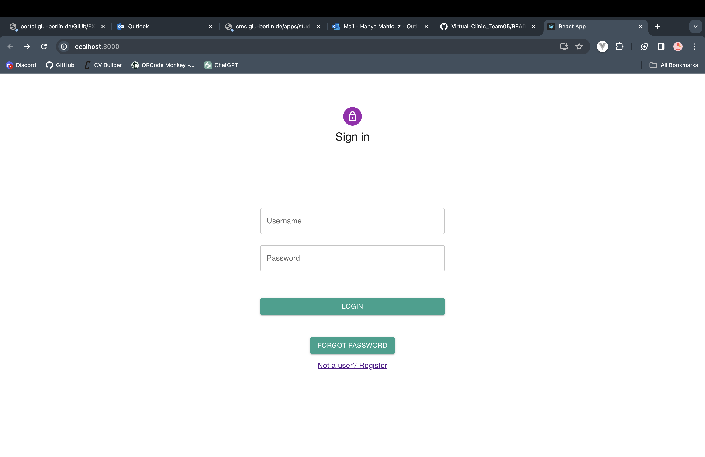
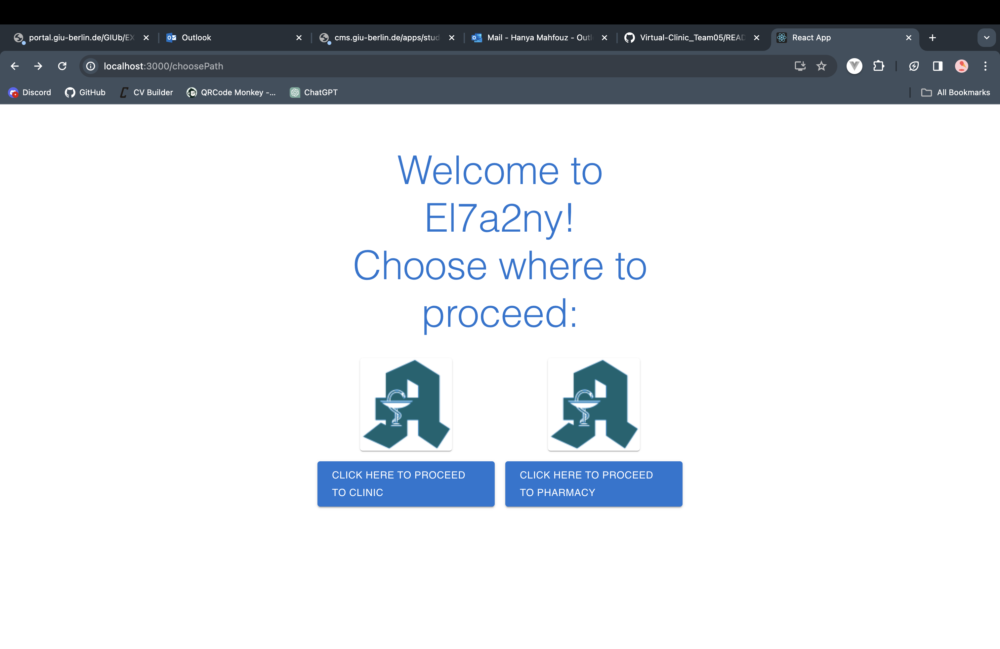
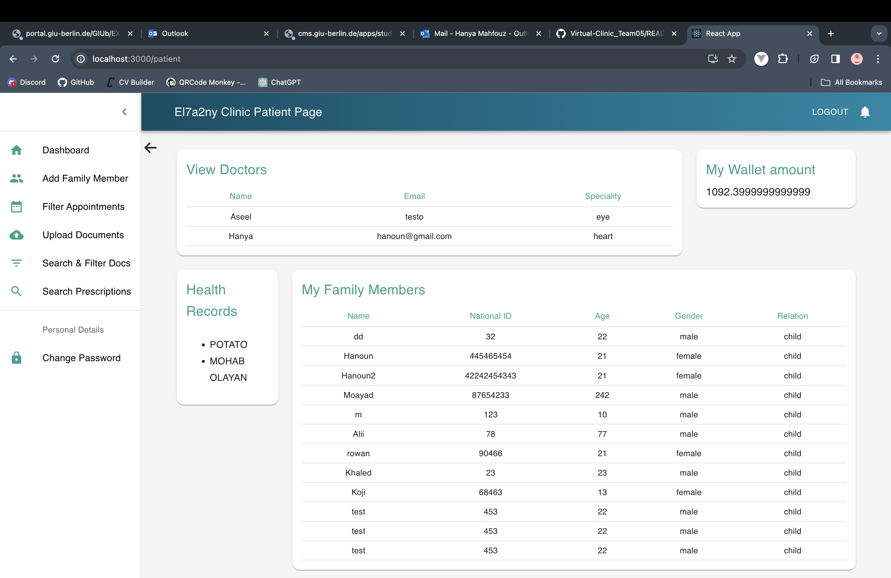
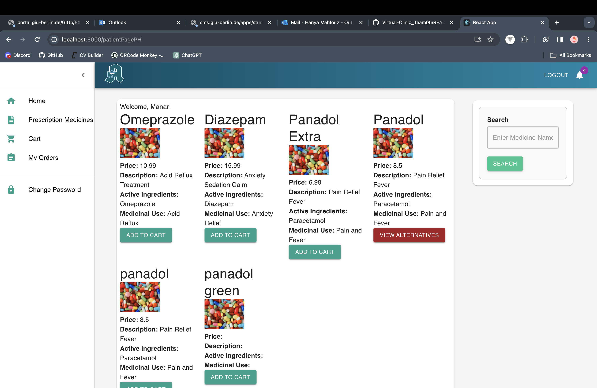

# Project Title

## El7a2ny

# Motivation

Welcome to our Virtual Clinic and Pharmacy Project!

In the ever-evolving landscape of healthcare, we recognize the need for accessible and innovative solutions. Our motivation behind this project is to contribute to the advancement of healthcare services by bridging the gap between traditional medical practices and the convenience of virtual platforms.

# Build Status

# Code Style

- Indentation: 2 spaces

- Naming Conventions: CamelCase for functions and variables, PascalCase for classes.

- Comments: Use comments to explain complex sections of code. Follow the JSDoc format for documenting functions.

# Screenshots






# Tech/Framework used

- React.js for the frontend
- Node.js for the backend
- Express.js as the backend framework
- MongoDB as the database

### Build Status 

<ul>
   <li>The project is currently in development.</li>
   <li>Some input fields are case senstive.</li>
   <li>Ui could be improved.</li>
   <li>There may bugs that isn't found yet.</li>
   <li>Changing of quantity in cart in pharmacy is buggy</li>
   <li>Upload documents in request to be a Doctor/Pharmacist is buggy</li> 
</ul>


# Features

### Doctor

1. **View Information and Health Records of Patient Registered with Me**
2. **View a List of All My Patients**
3. **Search for a Patient by Name**
4. **Filter Patients Based on Upcoming Appointments**
5. **Select a Patient from the List of Patients**
6. **Edit/Update My Email, Hourly Rate, or Affiliation (Hospital)**
7. **View All New and Old Prescriptions and Their Statuses**
8. **Schedule a Follow-Up for a Patient**
9. **Add New Health Records for a Patient**
10. **Reschedule an Appointment for a Patient**
11. **Add/Delete Medicine to/From the Prescription from the Pharmacy Platform (Not Now)**
12. **Add/Update Dosage for Each Medicine Added to the Prescription (Not Now)**
13. **View the Amount in My Wallet**

### Pharmacist

1. **View All Information Uploaded by a Pharmacist for Registration**
2. **Receive a Notification Once a Medicine Is Out of Stock on the System and Via Email**
3. **Upload and Submit Required Documents Upon Registration (ID, Pharmacy Degree, Working Licenses)**
4. **Login with Username and Password**
5. **Logout**
6. **Change My Password (Password Must Follow Specific Validation)**
7. **Reset Forgotten Password Through OTP Sent to Email**
8. **View Available Quantity and Sales of Each Medicine**
9. **Search for Medicine Based on Name**
10. **Filter Medicines Based on Medicinal Use**
11. **Add a Medicine with Its Details (Active Ingredients), Price, and Available Quantity**
12. **Edit Medicine Details and Price**
13. **Upload Medicine Image**
14. **Archive/Unarchive a Medicine**
15. **View a Total Sales Report Based on a Chosen Month**
16. **Filter Sales Report Based on a Medicine/Date**
17. **Chat with a Doctor**

### Patient

1. **Add Family Members**
2. **View Registered Family Members**
3. **Chat with a Doctor (Doctor/Patient Can Only Chat with Each Other if Patient Had at Least One Appointment with This Doctor)**
4. **Filter Appointments by Date/Status**
5. **View a List of All Doctors with Speciality and Session Price**
6. **Search for a Doctor by Name and/or Speciality**
7. **Filter a Doctor by Speciality and/or Availability**
8. **Select a Doctor from the Search/Filter Results**
9. **View All Details of Selected Doctor**
10. **View a List of All Prescriptions**
11. **Filter Prescriptions Based on Date/Doctor/Filled or Unfilled**
12. **Select a Prescription from the List**
13. **Upload/Remove Documents for My Medical History**
14. **Login with Username and Password**
15. **Logout**
16. **Change My Password (Password Must Follow Specific Validation)**
17. **Reset Forgotten Password Through OTP Sent to Email**
18. **Link Another Patient's Account as a Family Member**
19. **Choose to Pay for My Appointment Using My Wallet or Credit Card**
20. **Enter Credit Card Details and Pay for an Appointment Using Stripe (No Real Money Transaction)**
21. **View Uploaded Health Records**
22. **View Health Package Options and Details**
23. **Subscribe to a Health Package**
24. **Choose to Pay for the Health Package Using Wallet or Credit Card**
25. **View Subscribed Health Package**
26. **View Subscription Status for Health Package**
27. **Cancel a Subscription for Health Package**
28. **View All Available Appointments of a Selected Doctor**
29. **Select an Appointment Date and Time**
30. **View All Upcoming/Past Appointments**
31. **Filter Appointments by Date or Status**
32. **Reschedule an Appointment for Myself or for a Family Member**
33. **Cancel an Appointment for Myself or for a Family Member**
34. **Receive Notification of Appointment Cancellation or Rescheduling**
35. **Receive a Refund in My Wallet When a Doctor Cancels an Appointment**

### Administrator

1. **Add Another Administrator**
2. **Remove a Doctor/Patient/Admin/Pharmacist from the System**
3. **View All Information Uploaded by a Doctor for Registration**
4. **Add/Update/Delete Health Packages with Different Price Ranges**
5. **Accept or Reject Doctor Registration Requests**
6. **View and Accept the Employment Contract**

### Guest

1. **Register as a Patient**
2. **Submit a Request to Register as a Pharmacist Using Username, Name, Email, Password, Date of Birth, Hourly Rate, Affiliation (Hospital), Educational Background**
3. **Submit a Request to Register as a Doctor**

# Code Examples

    const modifyWalletDoctor = async (req, res) => {
    try {
    const price = req.body.price;
    const doctorId = req.body.id;

    // Fetch the specific appointment using the appointmentId
    const user = await userModel.findById(doctorId);

    // Check if the appointment exists
    if (!user) {
      return res.status(404).json({ message: "doctor not found" });
    }

    // Update the appointment with the new patientId
    user.walletInfo = user.walletInfo + price;


    // Save the modified appointment
    await user.save();

    res.status(200).json({ message: "doctor wallet updated successfully", user });
    } catch (err) {
    res.status(500).json({ message: err.message });
    }
    };

# Installation

- Clone the repository: git clone https://github.com/hanyasherif/Virtual-Clinic_Team05.git

- Install dependencies: npm install dotenv express mongoose node react socket.io nodemon

- Configure environment variables: Create a .env file and fill in the required values.

# API Refrences

To view all the routes:

**Run at route Directory**
   ```sh
   npm run generate-swagger
   ```

**Note:** you will find the routes in backend/swagger-output.json

# Tests

Testing is performed using Postman for API testing.

# How to Use

### Frontend

1. Navigate to the `frontend` directory: `cd frontend`
2. Install frontend dependencies: `npm install react`
3. Start the frontend server: `npm start`
4. Open your browser and visit: `http://localhost:3000`

### Backend

1. Install backend dependencies: `npm install mongoose dotenv express node nodemon socket.io`
2. Configure environment variables: Create a `.env` file and fill in the required values.
3. Start the backend server: `npm start`
4. The backend API will be accessible at: `http://localhost:8000`

# Contribute

We welcome collaboration and invite developers, healthcare professionals, and enthusiasts to join us on this journey. Together, we can create a platform that revolutionizes healthcare delivery.

Thank you for being a part of our mission to make healthcare more accessible and convenient for everyone.

Let's build a healthier future, one virtual interaction at a time!

# Credits

This project relies on the following technologies and frameworks:

- [Mongoose](https://mongoosejs.com/) - Elegant MongoDB object modeling for Node.js.
- [Express.js](https://expressjs.com/) - Fast, unopinionated, minimalist web framework for Node.js.
- [React](https://reactjs.org/) - A JavaScript library for building user interfaces.
- [Node.js](https://nodejs.org/) - A JavaScript runtime built on Chrome's V8 JavaScript engine.

### Additional Learning Resources:

- [MERN Stack Tutorial](https://www.youtube.com/watch?v=7CqJlxBYj-M) - A comprehensive video tutorial explaining the MERN stack.
- [Building a Full Stack MERN Application](https://www.youtube.com/watch?v=mrHNSanmqQ4) - Step-by-step guide on building a MERN stack application.
- [Implementing Video Chat in MERN Stack](https://www.youtube.com/watch?v=VIDEO_CHAT_LINK) - Learn how to implement video chat functionality in a MERN stack application.
- [Implementing Message Chats in MERN Stack](https://www.youtube.com/watch?v=MESSAGE_CHAT_LINK) - Explore a tutorial on adding message chat functionality to your MERN stack project.

A special thanks to the open-source community and contributors behind these tools that made the development of this project possible.

# License

This project is licensed under the Apache 2.0 License
